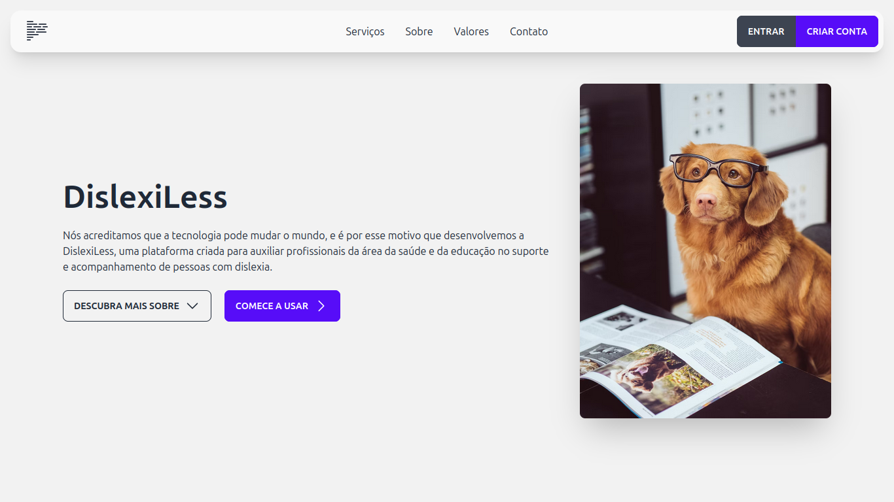

[](https://github.com/ArthurSegato/DislexiLess/actions/workflows/bun.yml)
<a href="https://donate.stripe.com/7sI29F4lo7Pt80g28a"></a>

DislexiLess is a solution composed of a web platform (Vue 3/Nest.js) and a mobile application (Flutter) that aims to facilitate the reading process for people with dyslexia and assist healthcare and education professionals in the treatment of individuals with dyslexia.

This tool was developed over a period of 4 months for my Computer Science thesis at Universidade Vila Velha. I was responsible for the development of the web platform, while [Eduardo](https://github.com/OmptOsu) was responsible for the mobile application. The full thesis can be found [here](.github/assets/DISLEXILESS_TCC-2_ARTHUR_EDUARDO.pdf).

## Requirements

- Bun v1.0.22 and above **OR** Node v21.2.0 and above

## Setup

Make sure to install the dependencies:

```bash
# npm
npm install

# pnpm
pnpm install

# yarn
yarn install

# bun
bun install
```

## Development

Start the development server on `http://localhost:3000`:

```bash
# npm
npm run dev

# pnpm
pnpm run dev

# yarn
yarn dev

# bun
bun dev
```

## Production

Build the application for production:

```bash
# npm
npm run build

# pnpm
pnpm run build

# yarn
yarn build

# bun
bun run build
```

## Disclaimer

Below is a list of all the external assets used in the development of this website with their respective licenses.

- [BootStrapp Icons](https://icons.getbootstrap.com) ([MIT](https://github.com/twbs/icons/blob/main/LICENSE.md))
- [Hero Icons](https://heroicons.com/) ([MIT](https://github.com/tailwindlabs/heroicons/blob/master/LICENSE))
- [daisyUI](https://daisyui.com/) ([MIT](https://github.com/saadeghi/daisyui/blob/master/LICENSE))

## Contributors

- [@ArthurSegato](https://github.com/ArthurSegato)
- [@OmptOsu](https://github.com/OmptOsu)
